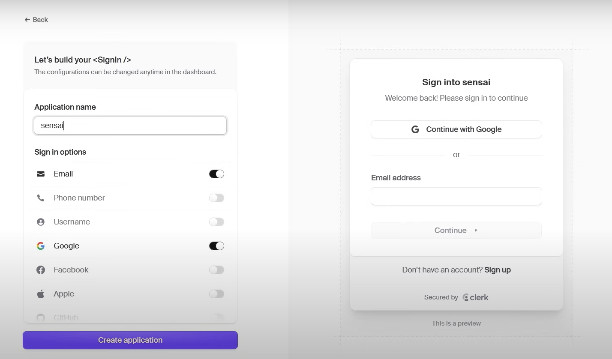
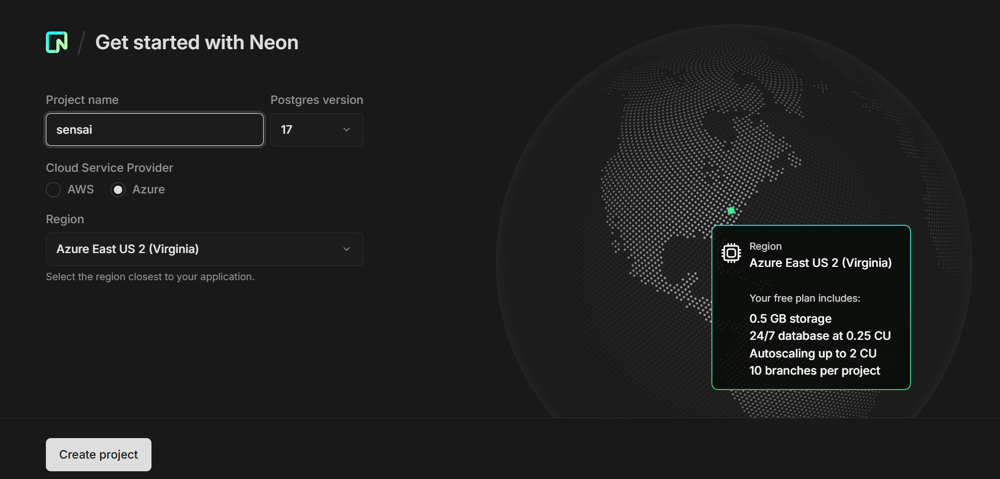
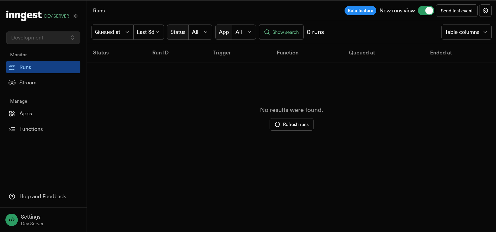

This is a [Next.js](https://nextjs.org) project bootstrapped with [`create-next-app`](https://github.com/vercel/next.js/tree/canary/packages/create-next-app).

# Tech Stack Used
- NextJS
- Shadcn UI
- Clerk
- Neon
- Inngest
- PostgreSQL
- Prisma
- Gemini AI

# Development

## Create a new Next.js project

Run this command to create a new nextjs project

```bash
npx create-next-app@latest
```

- Use TypeScript: No
- Use ESLint: Yes
- Use Tailwind CSS: Yes
- Code inside of src: No
- Use App Router: Yes
- Use Turbopack: Yes
- Customize the import Alias: No

Run this app using the following command:

```bash
npx run dev
```

## Install Shadcn UI and Components
Go to [Shadcn UI](https://ui.shadcn.com/docs/installation/next) for documentation. <br/>
Run ```npx shadcn@latest init``` to install the shadcn UI in our project.

We can install required components using this command:
```bash
npx shadcn@latest add accordion badge alert-dialog card dialog dropdown-menu input label progress radio-group select sonner tabs textarea
```

√ How would you like to proceed? » Use --legacy-peer-deps

### Dark Mode
- To implement the dark mode using the Shadcn UI, go to this [documentation](https://ui.shadcn.com/docs/dark-mode/next) or you can run this command:
```bash
npm install next-themes
```
- Create a **theme-provider.jsx** file inside components folder with the following code:
```javascript
"use client"

import * as React from "react"
import { ThemeProvider as NextThemesProvider } from "next-themes"

export function ThemeProvider({
  children,
  ...props
}: React.ComponentProps<typeof NextThemesProvider>) {
  return <NextThemesProvider {...props}>{children}</NextThemesProvider>
}
```

- Import ThemeProvider in layout.js file and wrap the children components inside it.
```javascript
import { ThemeProvider } from "@/components/theme-provider"

....

<ThemeProvider
    attribute="class"
    defaultTheme="system"
    enableSystem
    disableTransitionOnChange>
    {children}
</ThemeProvider>
```

## Configuring Clerk for User Authentication and Management
[Clerk](https://clerk.com/) gives us access to prebuilt components, React hooks, and helpers to make user authentication easier.
<br/>

Create a new App in Clerk with the given settings.
<div style="text-align: center;">
  
</div>

Then just follow the steps given by the clerk documentation.

## Configuring Neon for Backend Using PostgreSQL Database
- [Neon](https://neon.tech/) offers a serverless Postgres database platform for developers. 
- Instantly branch your data and schema to access isolated DB copies. 

Create project after login:
<div style="text-align: center;">
  
</div>

### Setup Role and Database
1. Go to **Overview** tab and click add role.
2. Give any name and create.
3. Go to add database, name it and choose the role that you have just created.
4. Go to **dashboard** tab and click on **Connect Database**.
5. Choose your newly created database, owner and copy the **connection** string.
6. Go to **.env** file and paste the URL in ```DATABASE_URL``` variable.

## Configure Inngest
[Inngest](https://www.inngest.com/) is an event-driven durable execution platform that allows you to run fast, reliable code on any platform, without managing queues, infra, or state.

Run these following commands:
```bash
npm i inngest
```
```bash
npx inngest-cli@latest dev
```

It will generate a localhost connection for Inngest server.
<div style="text-align: center;">
  
</div>

### Create an Inngest [Client](https://www.inngest.com/docs/getting-started/nextjs-quick-start)
Create a new folder inside lib folder called `inngest`, and then create a new file called `client.js`. <br/>
Paste the below code into the `client.js`.

```javascript
import { Inngest } from "inngest";

// Create a client to send and receive events
export const inngest = new Inngest({ id: "sensai",
    name: "Sensai",
 });
```
> Later on, we will configure the API for Gemini AI here.

## Setup /api/inngest route
Create a new folder called `api` inside app folder.
> We have to build a public api to connect to Inngest.
Create `inngest` folder inside api and `route.js` file inside inngest.
```js
import { serve } from "inngest/next";
import { inngest } from "../../../inngest/client";

// Create an API that serves zero functions
export const { GET, POST, PUT } = serve({
  client: inngest,
  functions: [
    /* your functions will be passed here later! */
  ],
});
```

Follow [youtube tutorial](https://youtu.be/UbXpRv5ApKA?list=PLKhlp2qtUcSZBJxjXbHBkE_3h5E31dDiu&t=2973) for more depth on how inngest can be used.

## Setup Prisma
Install [Prisma](https://www.prisma.io/) in the project using the following command:
```bash
npm i -D prisma
```

Next step is to initialize the project with Prisma.
```bash
npx prisma init
```

After creating models in **schema.prisma**, need to run this command to create tables in neon database.
```bash
npx prisma migrate dev --name create-models
```
This command will create tables in the neon database.
To run queries in the neon database, create a file **prisma.js** inside lib folder.
```javascript
import { PrismaClient } from "@prisma/client";

export const db = globalThis.prisma || new PrismaClient();
if(process.env.NODE_ENV !== 'production'){
    globalThis.prisma = db;
}
```

> **globalThis.prisma**: This global variable ensures that the Prisma client instance is reused across hot reloads during development. Without this, each time your application reloads, a new instance of prisma client would be created, potentially leading to connection issues.

## GEMINI AI Setup
Go to google and search GEMINI AI Api Key and get the api key from google site.
Paste the API Key in .env file
```bash
GEMINI_AI_API_KEY=[API_KEY]
```

Install this package using the below command:
```bash
npm i @google/generative-ai
```

Now to use GEMINI AI, we need to use these lines of code:
```javascript
import { GoogleGenerativeAI } from "@google/generative-ai";

const genAI = new GoogleGenerativeAI(process.env.GEMINI_AI_API_KEY);
const model = genAI.getGenerativeModel({
    model: "gemini-1.5-flash",
});
```

## Deploy on Vercel

The easiest way to deploy your Next.js app is to use the [Vercel Platform](https://vercel.com/new?utm_medium=default-template&filter=next.js&utm_source=create-next-app&utm_campaign=create-next-app-readme) from the creators of Next.js.

Check out our [Next.js deployment documentation](https://nextjs.org/docs/app/building-your-application/deploying) for more details.